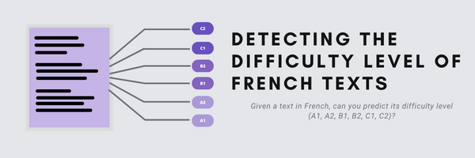

# DMML2022_Alpina
Sarah MOUGIN & Huynh phuong trang NGUYEN

## Detecting the difficulty of a french text

Our mission is to find the difficulty of the texts in the file unlabeled_data.csv, with the file traning_data.csv as source to train our different models.
The start csv files and those produced by our models are stored in the "data" folder.
The first models, such as Logistic Regression, KNN, Decision Tree Classifier, Random forest Classifier, were developed before the data cleaning process. Each model is developed in an .ipynb file, and all are stored in the "code" > "models_without_cleaning" folder.
Then, we elaborated the cleaning process in the file "code" > cleaning.ipynb which produces a new dataset, called "data" > new_training_data.csv, on which we reapply the models tested before, and then other models such as LinearSVC. These are stored in the folder "code > "model_with_cleaning".

Explanations about the processes and our sources are detailed in the file "documentation" > doc.pdf

## Results

We obtained the best accuracy with the process linear regression without cleaning, with a precision of 0.51 on Colab and 0.49 on Kaggle concerning the unlabeled_data.
